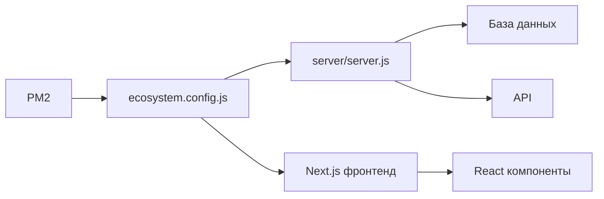

# 🔍 РАЗНИЦА МЕЖДУ ECOSYSTEM.CONFIG.JS И SERVER.JS

## 📋 Что это такое?

### `server/server.js` 
- 🎯 **Это сам код приложения** - Express сервер, маршруты, WebSocket, база данных
- 📝 **Здесь мы пишем логику** - обработку запросов, API endpoints, бизнес-логику
- 🔧 **Все наши правки** делаются именно в этом файле

### `ecosystem.config.js`
- ⚙️ **Это конфигурация для PM2** - как запускать, где логировать, сколько экземпляров
- 🎮 **Это инструкции для PM2** - "запусти этот файл с такими настройками"
- 📊 **Настройки запуска** - порты, переменные окружения, рестарты

## 🔄 Как это работает?



### Пошагово:
1. **PM2** читает `ecosystem.config.js`
2. **ecosystem.config.js** говорит PM2: "запусти `./server/server.js`"
3. **PM2** запускает `server/server.js` с указанными настройками
4. **server.js** создает Express сервер и подключается к БД

## 📁 Что где лежит?

```
malabar/
├── ecosystem.config.js     ← КОНФИГУРАЦИЯ PM2
├── server/
│   ├── server.js          ← КОД СЕРВЕРА (тут мы делаем правки)
│   └── package.json       ← зависимости сервера
├── pages/                 ← ФРОНТЕНД NEXT.JS
├── components/
└── package.json           ← зависимости фронтенда
```

## ⚡ В чем разница в запуске?

### Прямой запуск (для разработки):
```bash
cd server
node server.js
```

### Через PM2 (для продакшена):
```bash
pm2 start ecosystem.config.js
```

## 🎯 Почему через ecosystem.config.js?

### ✅ Преимущества:
- 🔄 **Автоматический перезапуск** при падении
- 📊 **Логирование** в файлы с ротацией
- 🎮 **Управление несколькими процессами** (фронтенд + бэкенд)
- 📈 **Мониторинг** ресурсов
- 🔧 **Настройки окружения** для продакшена
- 💾 **Ограничения памяти** и автоперезапуск

### ❌ Прямой запуск:
- 💥 При падении - всё, нужно запускать руками
- 📝 Логи только в консоль
- 🎯 Только один процесс
- 🛠️ Нет мониторинга

## 🚨 ВЫ ПРАВЫ - Я НЕ ЗАПУСТИЛ ФРОНТЕНД!

В `ecosystem.config.js` у нас **ДВА** приложения:

```javascript
{
  name: 'malabar-server',    // БЭКЕНД (API сервер)
  script: './server/server.js'
},
{
  name: 'malabar-frontend',  // ФРОНТЕНД (Next.js)
  script: 'npm',
  args: 'start'
}
```

### Я запускал только:
```bash
pm2 start ecosystem.config.js --only malabar-server  # ⚠️ ТОЛЬКО БЭКЕНД!
```

### А нужно запускать:
```bash
pm2 start ecosystem.config.js  # ✅ И БЭКЕНД И ФРОНТЕНД!
```

## 🔧 Исправленные команды:

### Полный перезапуск:
```bash
pm2 stop all
pm2 delete all
pm2 start ecosystem.config.js  # БЕЗ --only!
```

### Проверка:
```bash
pm2 status
# Должно быть:
# malabar-server   │ online
# malabar-frontend │ online
```

## 📊 Что должно работать:

- **Бэкенд API**: http://localhost:3001/api/health
- **Фронтенд**: http://localhost:3000
- **WebSocket**: ws://localhost:3001/ws

---

**Вывод**: Мы правим код в `server.js`, но запускаем через `ecosystem.config.js` для удобства управления в продакшене. И да, я забыл запустить фронтенд! 😅
